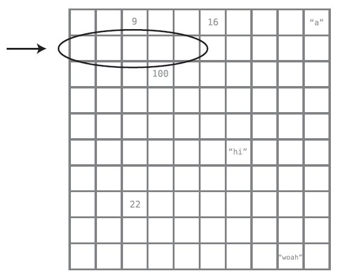
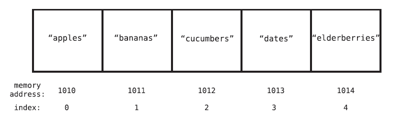

# CHAPTER 1. Why Data Structures Matter

- the organization of data can significantly impact how fast your code runs.

## Data Structures

- *Data*: all types of information, down to the most basic numbers and strings.
- *Data structures*: how data is organized
- The first step in writing fast code is to understand what data structures are
and how different data structures can affect the speed of our code.

### Data Structure Operations

- *Reading*: to look a value up with the index within the data structure
- *Searching*: to look an index up with the value within the data structure
- *Insertion*: to add a new value to the data structure
- *Deletion*: to remove a value from the data structure

### Measuring Speed

- ⭐ in terms of **steps**, not pure time
- *speed* = *time complexity* = *efficiency* = *performance* = *runtime*

## The Array: The Foundational Data Structure

### How Array Works in the Memory

- a computer's memory can be viewed as a giant collection of cells
  - every cell has its address in number and every cell's address is one number greater than the previous cell's address
  - a computer can jump to any memory address in on step if it knows the address number
- when a program declares an array, it allocates a set of empty cells in a row
  - it also makes note at which memory address the array begins and always keeps track of the array's size
  - that's why a computer can find the first value of an array in a single step and the value at any index by performing simple addition

### Steps

  | Operations | Best | Worst |
  | :--------: | :--: | :---: |
  | Reading | 1 | 1 |
  | Searching | 1 | N |
  | Insertion | 1 | N + 1 |
  | Deletion | 1 | N |

- *linear search*: a basic search operation in which the computer checks each cell one at once

## Sets: How a Single Rule Can Affect Efficiency

- *set*: a data structure that does not allow duplicate value to be contained within it

### Steps

  | Operations | Best | Worst |
  | :--------: | :--: | :---: |
  | Reading | 1 | 1 |
  | Searching | 1 | N |
  | Insertion | N + 1 | 2N + 1 |
  | Deletion | 1 | N |

- every insertion into a set first requires a search
- the rest operations are the same as an array
- so if you don't need each data in the array to be unique, an array may be preferable to a set
- ⭐ you must analyze the needs of your own application and decide which data structure is a better fit
