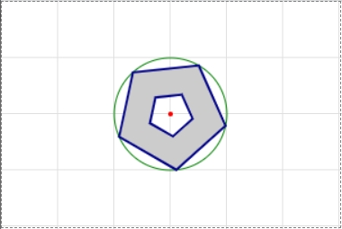

# CHAPTER 1. Canvas Tutorial

- 대부분의 Canvas drawing API는 `<canvas>` element 그 자신이 아닌 `getContext()` method를 통해 얻어지는 "drawing context" object에 정의되어 있음

```html
<body>
  <!-- This is a red square: -->
  <canvas id="square" width=10 height=10></canvas>.
  <!-- This is a blue circle: -->
  <canvas id="circle" width=10 height=10></canvas>.

  <script>
    // Get first canvas element and its context
    var canvas = document.getElementById("square");
    var context = canvas.getContext("2d");
    // Draw something in the canvas
    context.fillStyle = "#f00"; // Set color to red
    context.fillRect(0,0,10,10); // Fill a small square

    // Get second canvas and its context
    canvas = document.getElementById("circle");
    context = canvas.getContext("2d");
    // Begin a path and add a circle to it
    context.beginPath();
    context.arc(5, 5, 5, 0, 2*Math.PI, true);
    context.fillStyle = "#00f"; // Set blue fill
    context.fill(); // Fill the path
    </script>
</body>
```


## Drawing Lines and Filling Polygons

> How to define paths, how to draw or “stroke” the outline of a path, and how to fill the interior of a path

- path: a sequence of one or more subpaths
- subpath: a sequence of two or more points connected by line or curve segments

```js
c.beginPath(); // 새로운 path를 시작함
c.moveTo(20, 20); // 새로운 subpath의 시작점
c.lineTo(120, 120); // 새로운 subpath의 시작점에서 끝점으로 선을 그림
c.lineTo(20, 120); // 또 다른 subpath의 시작점(이전 subpath의 끝점)에서 끝점으로 선을 그림
// 아직 canvas에 아무 것도 안 나타남
// c.closePath();   // 닫는 stroke를 추가

c.fillStyle = "#ccc";
c.strokeStyle = "#008";
c.lineWidth = 2;
c.fill();
c.stroke();
```

- `stroke()`와 `fill()`은 `beginPath()`로 새로운 path를 시작하기 전 현재 path의 모든 subpath에 적용됨

*Example 1-1. Regular polygons with moveTo(), lineTo(), and closePath()*

```js
// 중심이 (x, y), 반지름이 r인 원의 둘레에 꼭지점이 위치하는 정다각형을 그리는 함수
function polygon(c, n, x, y, r, angle = 0, counterclockwise = false) {
    // 첫 꼭지점의 위치를 계산하고 그 점에서 subpath를 시작함
    // 첫 꼭지점은 원의 12시 지점 또는 거기서 주어진 angle만큼 이동한 지점
    c.moveTo(x + r * Math.sin(angle), y - r * Math.cos(angle));

    // 꼭지점의 사잇각
    const delta = (2 * Math.PI) / n;

    for (let i = 1; i < n; i++) {
        // subpath들을 이어갈 방향을 결정
        angle += counterclockwise ? -delta : delta;

        // 다음 꼭지점 위치를 결정하고 그 위치로 선을 그음
        c.lineTo(x + r * Math.sin(angle), y - r * Math.cos(angle));
    }

    // 마지막 꼭지점에서 첫 꼭지점으로 연결
    c.closePath();
}

const degToRad = (deg = 0) => {
    return (Math.PI * deg) / 180;
};

const CENTER_X = 150;
const CENTER_Y = 100;
const RADIUS = 50;

// 중심이 되는 원을 그림
c.beginPath();
c.arc(CENTER_X, CENTER_Y, RADIUS, 0, degToRad(360), true);
c.strokeStyle = "green";
c.stroke();

// 정다각형을 그림
c.beginPath();
polygon(c, 5, CENTER_X, CENTER_Y, RADIUS, degToRad(30));
polygon(c, 5, CENTER_X, CENTER_Y, 20, degToRad(30), true);
c.fillStyle = "#ccc";
c.strokeStyle = "#008";
c.lineWidth = 2;
c.fill();
c.stroke();

// 중심에 점을 찍음
c.beginPath();
c.arc(CENTER_X, CENTER_Y, 2, 0, 2 * Math.PI, true);
c.fillStyle = "red";
c.fill();
```



- 서로 다른 subpath가 겹치거나 하나의 subpath가 그 자신을 교차하면 canvas는 "nonzero winding rule"을 적용하여 어디가 안이고 밖인지 결정함

  > The Nonzero Winding Rule
  >
  > path 내부의 어떤 한 점 P가 path의 내부인지 외부인지 판단하는 방법
  >
  > 1. P에서 path 바깥으로 꼭지점을 지나지 않는 선을 긋는다.
  > 2. 그 선과 만나는 경계(path)가 시계방향으로 돌면 +1, 반시계방향으로 돌면 -1씩 카운팅한다.
  > 3. 경계를 모두 지났을 때 카운터가 0이면 바깥, 아니면 안
  > 
  > 
  > <https://redirect.cs.umbc.edu/~rheingan/435/pages/res/gen-10.Vis2-page-10sub-3.html>

## Graphics Attributes

-`fillStyle`, `strokeStyle`, `lineWidth`는 `fill()`과 `stroke()`의 parameter로 넘겨지는 것이 아니라 canvas 일반 `graphics state`의 일부임
