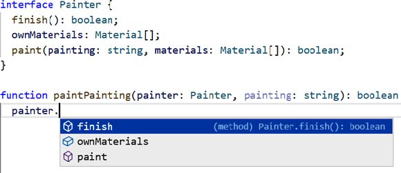

# Chapter 1. From JavaScript to TypeScript

## History of JavaScript

## Vanilla JavaScripts Pitfalls

### Costly Freedom

-   Vanilla JS는 코드를 구조화하는 방법에 거의 제한이 없음
-   이러한 자유는 코드의 규모가 커질수록 그 코드를 안전하게 구동하고 관리하는 것을 힘들게 만듬
-   예를 들어, 어떤 구체적인 context가 없다면 아래의 `paintPainting`함수를 어떻게 호출해야 하는지 어렴풋이 추축만 해볼 수 있음
    ```js
    function paintPainting(painter, painting) {
        return painter.prepare().paint(painting, painter.ownMaterials).finish();
    }
    ```

### Loose Documentation

-   JS 언어 사양에는 함수 매개변수, 함수 반환, 변수 또는 코드의 기타 구성이 무엇인지 설명하는 것을 공식화하는 내용이 없음
-   그래서 많은 개발자들은 주석 블럭을 이용하는 JSDoc를 표준으로 채택하여 함수와 변수를 설명함
-   하지만 JSDoc은 설명의 정확성을 보장하지 못함, 장황해짐, 잡일 증가 등 문제점이 있음

### Weaker Developer Tooling

-   다른 언어들(C#, Java 등)은 클래스 멤버 이름변경을 수행하거나 인수가 선언된 곳으로 바로 이동하는 기능등을 제공함
-   VS Code에서 이러한 기능을 제공하지만 완벽하지 않거나 내부에서 TS를 통해 제공되는 기능임

## TypeScript!

-   _Programming language_: 기존 JS의 모든 문법을 포함하고 정의와 type을 위한 새로운 문법이 포함된 언어
-   _Type checker_: JS 및 TS로 작성된 파일들을 가져와 모든 construct들(variables, functions 등)을 이해하고 잘못 설정되었다고 판단되는 것들을 알려주는 프로그램
-   _Compiler_: type checker를 실행하고 issue들을 알려준 뒤 equivalent JS code로 만들어내는 프로그램
-   _Language service_: type checker를 사용하여 개발자에게 유용한 기능을 어떻게 제공해야하는지 editor(VS code 등)에게 알려줌

## Getting Started in the TypeScript Playground

### TypeScript in Action

```ts
const firstName = "Georgia";
const nameLength = firstName.length();
// This expression is not callable.
```

### Freedom Through Restriction

```ts
// Previously: sayMyName(firstName, lastNameName) { ...
function sayMyName(fullName) {
    console.log(`You acting kind of shady, ain't callin' me ${fullName}`);
}
sayMyName("Beyoncé", "Knowles");
// ~~~~~~~~~
// Expected 1 argument, but got 2.
```

### Precise Documentation

```ts
interface Painter {
    finish(): boolean;
    ownMaterials: Material[];
    paint(painting: string, materials: Material[]): boolean;
}
function paintPainting(painter: Painter, painting: string): boolean {
    /* ... */
}
```

### Stronger Developer Tooling



### Compiling Syntax

> _Do I need babel if I use typescript?_
>
> If you already have a build pipeline that works for you, I don’t see any compelling reason to switch. However, if you’re starting out on a project, I would probably tend towards using the TypeScript compiler, potentially via something like ts-loader. Then later on if you find you need some transformation only Babel provides, you can pass the transpiled TypeScript output to Babel afterwards.
>
> https://blog.logrocket.com/babel-vs-typescript/

## Getting Started Locally

```bash
npm i -g typescript
tsc --version
tsc --init
tsc index.ts
```

## What TypeScript Is Not

### A Remedy for Bad Code

### Extensions to JavaScript (Mostly)

### Slower Than JavaScript

### Finished Evolving

## Summary
