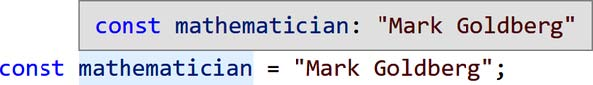
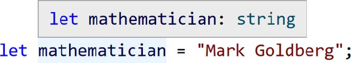

# Chapter 3. Unions and Literals

- _unions_: 어떤 값의 허용되는 type을 두개 이상이 되도록 확장하는 것
- _narrowing_: 어떤 값의 허용되는 type을 최대 한개까지 축소하는 것

## Union Types

- _union_: 여러 개의 type 중 하나인 경우를 나타내는 type
- |(pipe) operator를 이용해 나타냄

### Declaring Union Types

- union type은 변수의 초기값이 존재하는 경우에도 type annotation을 사용하는 예 중 하나

    ```ts
    let thinker: string | null = null;
    if (Math.random() > 0.5) {
        thinker = "Susanne Langer"; // Ok
    }
    ```

### Union Properties

- 값이 union type으로 알려지면, union 안의 가능한 모든 type에 공통적으로 존재하는 member property만 접근 가능

    ```ts
    let physicist = Math.random() > 0.5
    ? "Marie Curie"
    : 84;
    physicist.toString(); // Ok
    physicist.toUpperCase();
    // ~~~~~~~~~~~
    // Error: Property 'toUpperCase' does not exist on type 'string |
    number'.
    // Property 'toUpperCase' does not exist on type 'number'.
    physicist.toFixed();
    // ~~~~~~~
    // Error: Property 'toFixed' does not exist on type 'string |
    number'.
    // Property 'toFixed' does not exist on type 'string'.
    ```

- union type인 값의 가능한 일부 type에만 존재하는 member property를 사용하려면 그 지점에서 그 값은 특정 type이라는 것을 TS에게 알려줘야 함 -> `narrowing`

## Narrowing

- `narrowing`: TS가 코드로부터 어떤 값이 이전에 추론했던 넓은 type들(union)을 보다 구체적인 type으로 좁혀서 추론하는 것
- `type guard`: narrowing을 위해 사용될 수 있는 논리적 체크(Assignment Narrowing, Conditional Checks 등)

    > Definition과 Declaration의 차이  
    > **Declaration** of a variable is for informing the compiler of the following information: name of the variable, type of value it holds, and the initial value if any it takes. i.e., declaration gives details about the properties of a variable. Whereas, **Definition** of a variable says where the variable gets stored. i.e., memory for the variable is allocated during the definition of the variable. In C language definition and declaration for a variable takes place at the same time.
    > <https://www.geeksforgeeks.org/difference-between-definition-and-declaration/>

### Assignment Narrowing

- 변수에 값을 할당하면 TS는 그 변수의 type을 값의 type으로 narrowing

    ```ts
    let admiral: number | string;
    admiral = "Grace Hopper";
    admiral.toUpperCase(); // Ok: string
    admiral.toFixed();
    // ~~~~~~~
    // Error: Property 'toFixed' does not exist on type 'string'.
    ```

- 어떤 변수가 명시적인 union type annotation을 사용하면서 초기값 또한 할당받는 경우

    ```ts
    let inventor: number | string = "Hedy Lamarr";
    inventor.toUpperCase(); // Ok: string
    inventor.toFixed();
    // ~~~~~~~
    // Error: Property 'toFixed' does not exist on type 'string'.
    ```

### Conditional Checks

- 어떤 변수가 어떤 값과 같은지 `if`문을 사용하는 경우

    ```ts
    // Type of scientist: number | string
    let scientist = Math.random() > 0.5 ? "Rosalind Franklin" : 51;
    if (scientist === "Rosalind Franklin") {
        // Type of scientist: string
        scientist.toUpperCase(); // Ok
    }
    // Type of scientist: number | string
    scientist.toUpperCase();
    // ~~~~~~~~~~~
    // Error: Property 'toUpperCase' does not exist on type 'string | number'.
    // Property 'toUpperCase' does not exist on type 'number'.
    ```

### Typeof Checks

- `type of` 연산자로 type을 체크하는 경우

```ts
let researcher = Math.random() > 0.5 ? "Rosalind Franklin" : 51;
if (typeof researcher === "string") {
    researcher.toUpperCase(); // Ok: string
}
```

- logical negation

```ts
if (!(typeof researcher === "string")) {
    researcher.toFixed(); // Ok: number
} else {
    researcher.toUpperCase(); // Ok: string
}
```

## Literal Types

- `literal type`: 어떤 primitive 값 전부가 아닌, 그 중 특정 값의 type
    
    
- 각 primitive type을 가능한 모든 literal value의 union이라고 생각할 수도 있음
  - `boolean`: just `true` | `false`
  - `null` and `undefined`: both just have one literal value, themselves
  - `number`: 0 | 1 | 2 | ... | 0.1 | 0.2 | ...
  - `string`: "" | "a" | "b" | "c" | ... | "aa" | "ab" | "ac" | ...
- union type annotation은 literal들과 primitive들을 섞어 조합할 수도 있음

    ```ts
    let lifespan: number | "ongoing" | "uncertain";
    lifespan = 89; // Ok
    lifespan = "ongoing"; // Ok
    lifespan = true;
    // Error: Type 'true' is not assignable to
    // type 'number | "ongoing" | "uncertain"'
    ```

### Literal Assignability

- 같은 primitive type의 다른 literal type들은 서로 할당가능하지 않음

    ```ts
    let specificallyAda: "Ada";
    specificallyAda = "Ada"; // Ok
    specificallyAda = "Byron";
    // Error: Type '"Byron"' is not assignable to type '"Ada"'.
    let someString = ""; // Type: string
    specificallyAda = someString;
    // Error: Type 'string' is not assignable to type '"Ada"'.
    ```

## Strict Null Checking

### The Billion-Dollar Mistake

- strict null checking이 없는 언어에서는 아래 코드처럼 `string` type인 변수에 `null`을 할당하는 것이 가능함

    ```ts
    const firstName: string = null;
    ```

- TS에서 `strictNullChecks` 옵션을 끄는 것은 코드 상 모든 type에 `| null | undefined`를 추가하는 것

    ```ts
    let nameMaybe = Math.random() > 0.5 ? "Tony Hoare" : undefined;
    nameMaybe.toLowerCase();
    // Potential runtime error: Cannot read property 'toLowerCase' of undefined.
    ```

- 일반적으로 TS의 best practice는 `strictNullChecks` 옵션을 켜는 것

### Truthiness Narrowing

- JS에서는 다음 값을 제외하고 모두 `true`(8개)
  - `false`, `0`, `-0`, `0n`, "", `null`, `undefined`, `NaN`
- 어떤 변수가 가능한 값 중 일부만 `true`일 수 있는 경우, truthiness check를 통해 변수의 type을 narrowing 할 수 있음

    ```ts
    let geneticist = Math.random() > 0.5 ? "Barbara McClintock" : undefined;
    if (geneticist) {
        geneticist.toUpperCase(); // Ok: string
    }
    geneticist.toUpperCase();
    // Error: Object is possibly 'undefined'.
    ```

    ```ts
    geneticist && geneticist.toUpperCase(); // Ok: string | undefined
    geneticist?.toUpperCase(); // Ok: string | undefined
    ```

- type이 `string | undefined`인 값이 `false`라는 것을 확인한다고 해도, 그 변수가 "" 또는 `undefined`인지 알려주는 것은 아님

    ```ts
    let biologist = Math.random() > 0.5 && "Rachel Carson";
    if (biologist) {
        biologist; // Type: string
    } else {
        biologist; // Type: false | string
    }
    ```

### Variables Without Initial Values

- 어떤 변수의 type을 정했더라도 초기값을 할당하지 않은 채 그 변수를 사용하려고 하면 error 발생

    ```ts
    let mathematician: string;
    mathematician?.length;
    // Error: variable 'mathematician' is used before being assigned.
    mathematician = "Mark Goldberg";
    mathematician.length; // Ok
    ```

- 하지만 그 type이 `undefined`를 포함한다면 괜찮음

    ```ts
    let mathematician: string | undefined;
    mathematician?.length; // Ok
    mathematician = "Mark Goldberg";
    mathematician.length; // Ok
    ```

## Type Aliases

- `type aliases`: 재사용되는 type들에게 이름을 붙이는 것

     ```ts
    type RawData = boolean | number | string | null | undefined;
    let rawDataFirst: RawData;
    let rawDataSecond: RawData;
    let rawDataThird: RawData;
    ```

### Type Aliases Are Not JavaScript

- type aliases는 type annotation처럼 JS output으로 컴파일되지 않음
- TS type system에서만 존재함(a development-time construct)

### Combining Type Aliases

- 어떤 type aliases는 다른 type aliases를 참조할 수도 있음
- 사용 순서에 따라 선언할 필요 없음

    ```ts
    type IdMaybe = Id | undefined | null; // Ok
    type Id = number | string;
    ```
