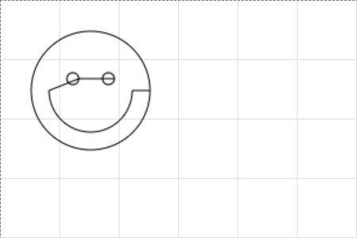
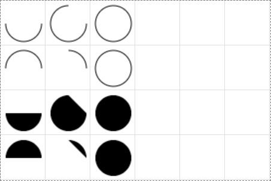
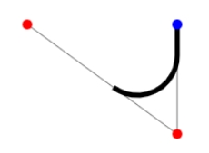
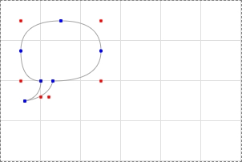
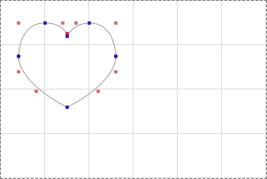

# Drawing shapes with canvas

## The grid

## Drawing rectangles

- SVG와 다르게 `<canvas>`는 오직 2개의 primitive shape만 지원함.
  - rectangles와 path
  - 다른 shape들은 1개 이상의 path를 조합해서 만들어야 함
- `clearRect(x, y, width, height)`: 특정 사각형 영억을 지워서 투명하게 만듬

## Drawing paths

- path를 만들기 위한 첫 단계는 `beginPath()`를 호출하는 것
  - 그 후 path는 subpath들(lines, arcs, etc)의 list의 형태로 저정됨
  - 이 method를 호출할 때마다 list는 reset되고 새로운 shape을 그리기 시작할 수 있음
  > NOTE  
  > 현재 path가 비어 있다면(`beginPath` 호출 후 또는 새 canvas를 만든 후), 첫 path를 만드는 명령은 언제나 `moveTo()`로 취급됨. 따라서 리셋후에는 `moveTo()`를 써야함
- `closePath()`를 사용했을 때 이미 shape가 닫혀있거나 점이 하나이면 아무것도 안함
  > NOTE  
  > `fill()`을 호출하면 자동으로 shape이 닫혀서 `closePath()`를 호출할 필요 없음. 그러나 `stroke()`는 수동으로 해야함

### Drawing a triangle

### Moving the pen

- `moveTo()`는 아무것도 그리지 않지만 path list의 일부가 됨
- 종이에서 새로운 것을 그리기 위해 펜을 들어 옮긴다고 생각하면 됨
- canvas를 초기화한 뒤, `beginPath()`를 호출한 뒤 또는 연결되지 않은 path를 그리기 위해 사용

  ```js
    ctx.beginPath();
    // ctx.moveTo(125, 75);
    ctx.arc(75, 75, 50, 0, Math.PI * 2, true); // Outer circle
    // ctx.moveTo(110, 75);
    ctx.arc(75, 75, 35, 0, Math.PI, false); // Mouth (clockwise)
    // ctx.moveTo(65, 65);
    ctx.arc(60, 65, 5, 0, Math.PI * 2, true); // Left eye
    // ctx.moveTo(95, 65);
    ctx.arc(90, 65, 5, 0, Math.PI * 2, true); // Right eye
    ctx.stroke();
  ```

  

### Lines

- `lineTo(x, y)`: 현재 점(이전 path의 끝지점)으로 부터 (x, y)까지 직선을 그림

### Arcs

- `arc(x, y, radius, startAngle, endAngle, counterclockwise)`: 중심이 (x, y)이고 반지름이 radius인 원의 startAngle을 시작점으로 하여 counterclockwise방향으로 endAngle이 되는 점까지 원을 따라 arc를 그림

  ```js
  for (let row = 0; row < 4; row++) {
      for (let col = 0; col < 3; col++) {
        ctx.beginPath();
        const x = 25 + col * 50; // x coordinate
        const y = 25 + row * 50; // y coordinate
        const radius = 20; // Arc radius
        const startAngle = 0; // Starting point on circle

        // 0: 180, 1: 270, 2: 360
        const endAngle = Math.PI + (Math.PI * col) / 2; // End point on circle

        // 0, 2: 시계방향, 1, 3: 반시계방향
        const counterclockwise = row % 2 !== 0; // clockwise or counterclockwise

        ctx.arc(x, y, radius, startAngle, endAngle, counterclockwise);

        if (row > 1) {
          ctx.fill();
        } else {
          ctx.stroke();
        }
      }
    }
  ```

  

- [`arcTo(x1, y1, x2, y2, radius)`](https://developer.mozilla.org/en-US/docs/Web/API/CanvasRenderingContext2D/arcTo): 현재 위치와 (x1, y1)을 잇는 직선과 (x1, y1)과 (x2, y2)를 잇는 직선 사이에 접하는 반지름이 radius인 arc를 만들고 현재 위치와 직선으로 연결함

  

### Bezier and quadratic curves

- [Bézier curve](https://developer.mozilla.org/en-US/docs/Glossary/Bezier_curve)
  - 컴퓨터 그래픽이나 애니메이션에서 수학적으로 곡선을 묘사하기 위해 사용하는 방법
  - 가상의 직선 두개(P0-P1, P1-P2)를 긋는다.
  - P0-P1과 P1-P2에서 같은 portion에 해당하는 두 점을 이어 또 하나의 직선(A)을 긋는다.
  - 0 ~ 100%에 따라 세 직선위의 점이 그 portion에 맞게 이동하며, A 직선위의 점이 그리는 궤적이 Bezier curves가 된다.
  

- `quadraticCurveTo(cp1x, cp1y, x, y)`, `bezierCurveTo(cp1x, cp1y, cp2x, cp2y, x, y)`
  

  ```js
  class Canvas {
    constructor(id, width = 300, height = 200) {
      this.element = document.getElementById(id);
      this.ctx = this.element.getContext("2d");
      this.element.width = width;
      this.element.height = height;
    }
  }

  class QuadraticBezier extends Canvas {
    constructor(id, width, height, coords) {
      super(id, width, height);
      this.coords = coords;
      this.draw();
    }

    draw() {
      this.ctx.beginPath();
      this.coords.forEach((coord, i) => {
        if (i === 0) this.ctx.moveTo(coord.SP.x, coord.SP.y);
        this.drawCurve(coord);
      });
      this.ctx.strokeStyle = "#a3a3a3";
      this.ctx.stroke();

      this.coords.forEach((coord) => {
        this.indicatePoints(coord);
      });
    }

    indicatePoints(coord) {
      this.ctx.beginPath();
      this.ctx.moveTo(coord.CP.x, coord.CP.y);
      this.ctx.arc(coord.CP.x, coord.CP.y, 2, 0, Math.PI * 2, true);
      this.ctx.fillStyle = "red";
      this.ctx.fill();

      this.ctx.beginPath();
      this.ctx.moveTo(coord.SP.x, coord.SP.y);
      this.ctx.arc(coord.SP.x, coord.SP.y, 2, 0, Math.PI * 2, true);
      this.ctx.moveTo(coord.EP.x, coord.EP.y);
      this.ctx.arc(coord.EP.x, coord.EP.y, 2, 0, Math.PI * 2, true);
      this.ctx.fillStyle = "blue";
      this.ctx.fill();
    }

    drawCurve(coord) {
      this.ctx.quadraticCurveTo(coord.CP.x, coord.CP.y, coord.EP.x, coord.EP.y);
    }
  }

  const coords = [
    {
      SP: { x: 75, y: 25 },
      EP: { x: 25, y: 62.5 },
      CP: { x: 25, y: 25 }
    },
    {
      SP: { x: 25, y: 62.5 },
      EP: { x: 50, y: 100 },
      CP: { x: 25, y: 100 }
    },
    {
      SP: { x: 50, y: 100 },
      EP: { x: 30, y: 125 },
      CP: { x: 50, y: 120 }
    },
    {
      SP: { x: 30, y: 125 },
      EP: { x: 65, y: 100 },
      CP: { x: 60, y: 120 }
    },
    {
      SP: { x: 65, y: 100 },
      EP: { x: 125, y: 62.5 },
      CP: { x: 125, y: 100 }
    },
    {
      SP: { x: 125, y: 62.5 },
      EP: { x: 75, y: 25 },
      CP: { x: 125, y: 25 }
    }
  ];

  const speechBubble = new QuadraticBezier("c", 300, 200, coords);
  ```

  

  ```js
  class CubicBeizer extends Canvas {
    constructor(id, width, height, coords) {
      super(id, width, height);
      this.coords = coords;
      this.draw();
    }

    draw() {
      this.ctx.beginPath();
      this.coords.forEach((coord, i) => {
        if (i === 0) this.ctx.moveTo(coord.SP.x, coord.SP.y);
        this.drawCurve(coord);
      });
      this.ctx.strokeStyle = "#a3a3a3";
      this.ctx.stroke();

      this.coords.forEach((coord) => {
        this.indicatePoints(coord);
      });
    }

    drawCurve(coord) {
      this.ctx.bezierCurveTo(
        coord.CP1.x,
        coord.CP1.y,
        coord.CP2.x,
        coord.CP2.y,
        coord.EP.x,
        coord.EP.y
      );
    }

    indicatePoints(coord) {
      this.ctx.beginPath();
      this.ctx.moveTo(coord.CP1.x, coord.CP1.y);
      this.ctx.arc(coord.CP1.x, coord.CP1.y, 2, 0, Math.PI * 2, true);
      this.ctx.moveTo(coord.CP2.x, coord.CP2.y);
      this.ctx.arc(coord.CP2.x, coord.CP2.y, 2, 0, Math.PI * 2, true);
      this.ctx.fillStyle = "rgba(255, 0, 0, 0.7)";
      this.ctx.fill();

      this.ctx.beginPath();
      this.ctx.moveTo(coord.SP.x, coord.SP.y);
      this.ctx.arc(coord.SP.x, coord.SP.y, 2, 0, Math.PI * 2, true);
      this.ctx.moveTo(coord.EP.x, coord.EP.y);
      this.ctx.arc(coord.EP.x, coord.EP.y, 2, 0, Math.PI * 2, true);
      this.ctx.fillStyle = "rgba(0, 0, 255, 0.7)";
      this.ctx.fill();
    }
  }

  const coords = [
    {
      SP: { x: 75, y: 40 },
      EP: { x: 50, y: 25 },
      CP1: { x: 75, y: 37 },
      CP2: { x: 70, y: 25 }
    },
    {
      SP: { x: 50, y: 25 },
      EP: { x: 20, y: 62.5 },
      CP1: { x: 20, y: 25 },
      CP2: { x: 20, y: 62.5 }
    },
    {
      SP: { x: 20, y: 62.5 },
      EP: { x: 75, y: 120 },
      CP1: { x: 20, y: 80 },
      CP2: { x: 40, y: 102 }
    },
    {
      SP: { x: 75, y: 120 },
      EP: { x: 130, y: 62.5 },
      CP1: { x: 110, y: 102 },
      CP2: { x: 130, y: 80 }
    },
    {
      SP: { x: 130, y: 62.5 },
      EP: { x: 100, y: 25 },
      CP1: { x: 130, y: 62.5 },
      CP2: { x: 130, y: 25 }
    },
    {
      SP: { x: 100, y: 25 },
      EP: { x: 75, y: 40 },
      CP1: { x: 85, y: 25 },
      CP2: { x: 75, y: 37 }
    }
  ];
  const heart = new CubicBeizer("c", 300, 200, coords);
  ```

  

### Rectangles

- `fillRect()`와 같이 canvas에 직접 사각형을 그리는 대신 `rect(x, y, width, height)`를 사용하면 open path에 rectangular path를 추가할 수도 있음
- `rect()`을 호출하면 자동으로 `moveTo(x, y)`가 호출되어 pen 위치가 (x, y)로 reset됨

### Making combinations

## Path2D objects

### Path2D example

### Using SVG paths
